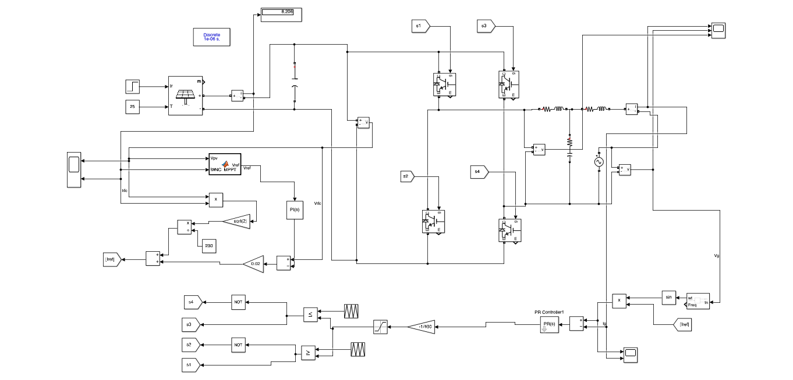

# PV-Incremental-Conductance-MPPT-Grid-Integration

Independent MATLAB/Simulink implementation of a single-stage, single-phase grid-connected photovoltaic (PV) inverter featuring Incremental Conductance MPPT, DC-link voltage control, PLL-based grid synchronization, PR current control, and PWM-based inverter switching.

## Overview

This project presents an independently developed MATLAB/Simulink model of a grid-connected photovoltaic energy conversion system.

The implementation is based on the control methodology presented in the research paper:

**M. Ciobotaru, R. Teodorescu, and F. Blaabjerg,  
"Control of single-stage single-phase PV inverter,"  
EPE 2005, Dresden.**

The referenced work presents a single-stage PV inverter control structure incorporating:

- Incremental Conductance Maximum Power Point Tracking (MPPT)
- Phase-Locked Loop (PLL) based grid synchronization
- DC-voltage control
- Grid-current control
- Proportional-Resonant (PR) current control

The Simulink model in this repository was independently reconstructed and implemented based on the published methodology. The implementation was developed independently rather than using the authors' original simulation files.

---

## System Architecture

The implemented power-conversion path is:

```text 
              SOLAR IRRADIANCE
                     │
                     ▼
              ┌─────────────┐
              │  PV ARRAY   │
              └──────┬──────┘
                     │
              Vpv, Ipv
                     │
                     ▼
        ┌────────────────────────┐
        │ Incremental Conductance│
        │          MPPT          │
        └────────────┬───────────┘
                     │
                    Vref
                     │
                     ▼
        ┌────────────────────────┐
        │   DC-Link PI Control   │
        └────────────┬───────────┘
                     │
                     ▼
              ┌─────────────┐
              │   DC LINK   │
              │  CAPACITOR  │
              └──────┬──────┘
                     │
                     ▼
             ┌──────────────┐
             │ FULL-BRIDGE  │
             │     VSC      │
             └──────┬───────┘
                    │
                   PWM
                    │
                    ▼
             ┌──────────────┐
             │ AC FILTER /  │
             │  INTERFACE   │
             └──────┬───────┘
                    │
                    ▼
                   GRID
```

The control system additionally contains:

```text
Grid Voltage
     │
     ▼
    PLL
     │
     ▼
 Grid Phase ──────► Sinusoidal Current Reference
                            │
                            ▼
                    PR Current Controller
                            │
                            ▼
                       PWM Logic
                            │
                            ▼
                        VSC Gates
```

---

## Simulink Model

The complete Simulink model is provided in:

```text
01_Model/sgs_assin_2.slx
```

### Updated Model



The model contains the PV array, Incremental Conductance MPPT, DC-link voltage controller, full-bridge VSC, AC interface, PLL, PR current controller, and PWM switching logic.

---

## Key Features

### Photovoltaic Array

The PV array is modeled using configurable PV module parameters and variable irradiance.

### Incremental Conductance MPPT

The MPPT controller uses measured PV voltage and current to determine the operating point relative to the maximum-power point.

### DC-Link Voltage Control

A PI controller regulates the DC-link voltage according to the reference generated by the MPPT controller.

### Single-Phase Full-Bridge VSC

A four-switch IGBT/Diode full-bridge is used to convert the DC-link voltage into controlled AC power.

### PLL Synchronization

A Phase-Locked Loop is used to estimate the grid phase and synchronize the inverter current with the grid.

### PR Current Control

A Proportional-Resonant controller is used for sinusoidal grid-current tracking.

### PWM Switching

Carrier-based PWM logic generates the gate signals for the four inverter switches.

---

# PV Array Parameters

| Parameter | Value |
|---|---:|
| Modules in series | 12 |
| Modules in parallel | 1 |
| Module rated power | 235.008 W |
| Module Vmp | 30.6 V |
| Module Imp | 7.68 A |
| Module Voc | 36.72 V |
| Module Isc | 8.23 A |
| Temperature | 25 °C |
| Array Vmp | 367.2 V |
| Array Voc | 440.64 V |
| Nominal array power | ≈ 2.82 kW |

The array maximum-power voltage is approximately:

```text
Vmp,array = 12 × 30.6
          = 367.2 V
```

The nominal array maximum power is approximately:

```text
Pmp,array ≈ 12 × 235.008
          ≈ 2.82 kW
```

---

# Incremental Conductance MPPT

The Incremental Conductance method is based on the PV power relationship:

```text
P = V × I
```

At the maximum-power point:

```text
dP/dV = 0
```

Therefore:

```text
I + V(dI/dV) = 0
```

and:

```text
dI/dV = -I/V
```

The controller compares the incremental conductance:

```text
ΔI/ΔV
```

with the instantaneous conductance:

```text
-I/V
```

and adjusts the reference voltage toward the maximum-power operating point.

### MPPT Parameters

| Parameter | Value |
|---|---:|
| Voltage reference step | 0.0002 |
| Comparison tolerance | 1e-6 |
| Inputs | Vpv, Ipv |
| Output | Vref |

The MATLAB implementation is available in:

```text
02_Controller/INC_MPPT.m
```

---

# DC-Link Voltage Control

The DC-link provides the energy interface between the PV array and the grid-side converter.

A PI controller regulates the DC-link voltage.

| Parameter | Value |
|---|---:|
| Controller | PI |
| Kp | 0.3 |
| Ki | 0.1 |
| DC-link capacitance | 1000 µF |
| Initial DC-link voltage | 500 V |

The energy stored in the DC-link capacitor is:

```text
E = 1/2 C V²
```

At the initial voltage:

```text
E = 1/2 × 0.001 × 500²
  = 125 J
```

---

# Grid-Side Converter

The grid-side converter uses a single-phase full-bridge topology consisting of four IGBT/Diode switches.

| Parameter | Value |
|---|---:|
| Topology | Single-phase full bridge |
| Switching devices | 4 × IGBT/Diode |
| PWM frequency | ≈ 5 kHz |
| Grid voltage | 325 V peak |
| Grid RMS voltage | ≈ 230 V |
| Grid frequency | 50 Hz |

The PWM carrier period is approximately:

```text
Tsw = 1 / 5000
    = 200 µs
```

---

# PLL Synchronization

The PLL estimates the phase and frequency of the grid voltage.

The estimated phase is used to generate a synchronized sinusoidal current reference for the grid-current controller.

The PLL therefore provides the synchronization link between the grid voltage and the inverter current reference.

---

# PR Current Controller

The grid current is regulated using a Proportional-Resonant controller.

| Parameter | Value |
|---|---:|
| Proportional gain kp | 1.2 |
| Resonant gain kr | 750 |
| Resonant frequency | 50 Hz |

The controller follows the general form:

```text
GPR(s) = kp + kr·s / [s² + (2πf)²]
```

The resonant term provides increased gain around the grid fundamental frequency and is used for sinusoidal current tracking.

---

# Simulation Configuration

| Parameter | Value |
|---|---:|
| Simulation mode | Discrete |
| Powergui sample time | 1 µs |
| Simulation duration | 2 s |
| PV temperature | 25 °C |
| Initial irradiance | 500 W/m² |
| Final irradiance | 1000 W/m² |
| Irradiance step time | 0.5 s |
| Grid frequency | 50 Hz |
| PWM frequency | ≈ 5 kHz |

### Irradiance Test

The primary simulation applies an irradiance step:

```text
t < 0.5 s       → 500 W/m²
t = 0.5 s       → Irradiance step
t > 0.5 s       → 1000 W/m²
```

This disturbance is used to study the response of the MPPT, DC-link controller, VSC and grid-current controller.

---

# Control Sequence

1. PV irradiance and temperature determine the PV characteristics.
2. PV voltage and current are measured.
3. Incremental Conductance MPPT determines the direction toward the MPP.
4. The MPPT generates the voltage reference Vref.
5. The measured DC-link voltage is compared with Vref.
6. The PI controller processes the DC-link voltage error.
7. Grid voltage is measured.
8. The PLL estimates grid phase.
9. A synchronized sinusoidal current reference is generated.
10. Measured grid current is compared with the reference.
11. The PR controller processes the current error.
12. The controller output is passed to the PWM logic.
13. Four gate signals are generated for the VSC.
14. The VSC transfers power from the DC-link to the grid.

---


---

# Model Verification Note

The physical AC source, PLL and PR controller are configured for a **50 Hz grid**.

The supplied Powergui configuration contains a stored fundamental-frequency value of **60 Hz**.

Therefore, the relevant Powergui fundamental-frequency setting should be checked and made consistent with the 50 Hz grid before performing or reporting final FFT/RMS analysis.

---

# Project Structure

```text
PV-Incremental-Conductance-MPPT-Grid-Integration/
│
├── README.md
│
├── 01_Model/
│   └── sgs_assin_2.slx
│
├── 02_Controller/
│   ├── INC_MPPT.m
│   └── PR_Controller.md
│
├── 03_Documentation/
│   ├── PV_Incremental_Conductance_Grid_Integration_Report.docx
│   ├── PV_Incremental_Conductance_Grid_Integration_Expanded_Report.docx
│   └── PV_Incremental_Conductance_Grid_Integration_Report.pdf
│
├── 04_Figures/
│   └── system_model.png
│
└── 05_Results/
    └── README.md
```

---

# Research Reference

The control methodology used as the basis for this implementation is described in:

**M. Ciobotaru, R. Teodorescu, and F. Blaabjerg,  
"Control of single-stage single-phase PV inverter,"  
EPE 2005, Dresden.**

The referenced research presents a single-stage PV inverter control structure incorporating Incremental Conductance MPPT, PLL-based grid synchronization, DC-voltage control and grid-current control.

This repository contains an **independent MATLAB/Simulink implementation** based on the published methodology.

The original research paper, its text, figures, experimental results and other copyrighted content remain the property of their respective authors and publisher.

---

# Academic Attribution

This project is an independent reconstruction and implementation of the published methodology.

The project demonstrates the implementation and simulation of:

- PV system modeling
- Incremental Conductance MPPT
- DC-link voltage regulation
- Full-bridge VSC operation
- PLL-based grid synchronization
- PR current control
- PWM generation
- Grid integration

The underlying control methodology is attributed to the referenced research work and is not claimed as original research by this project.

---

# Future Improvements

Possible extensions include:

- Adaptive-step Incremental Conductance MPPT
- Temperature variation studies
- Multiple irradiance profiles
- Comparison with Perturb & Observe MPPT
- Grid-current THD analysis
- Active/reactive power analysis
- Current-controller comparison
- Harmonic compensation
- DC-link overvoltage protection
- Converter current limiting
- Grid-loss / anti-islanding protection
- Experimental hardware implementation

---

# Software Requirements

- MATLAB
- Simulink
- Simscape Electrical
- MATLAB Function support
- Powergui

The exact MATLAB release used for the final simulation should be recorded to improve reproducibility.

---

# License

**All Rights Reserved**

The implementation and project files in this repository are provided for educational and research purposes.

The repository owner retains rights to the original implementation and project files. Redistribution, commercial use, or modification of the complete project should not be assumed to be permitted without permission.

The referenced research paper and its original contents remain subject to the copyright and publication terms of their respective authors and publisher.

---

## Author

**Bhargab Gogoi**

M.Tech – Smart Grid  
Electrical Engineering

**Areas:** Power Electronics | Smart Grid | PV Systems | Control Systems | MATLAB/Simulink
